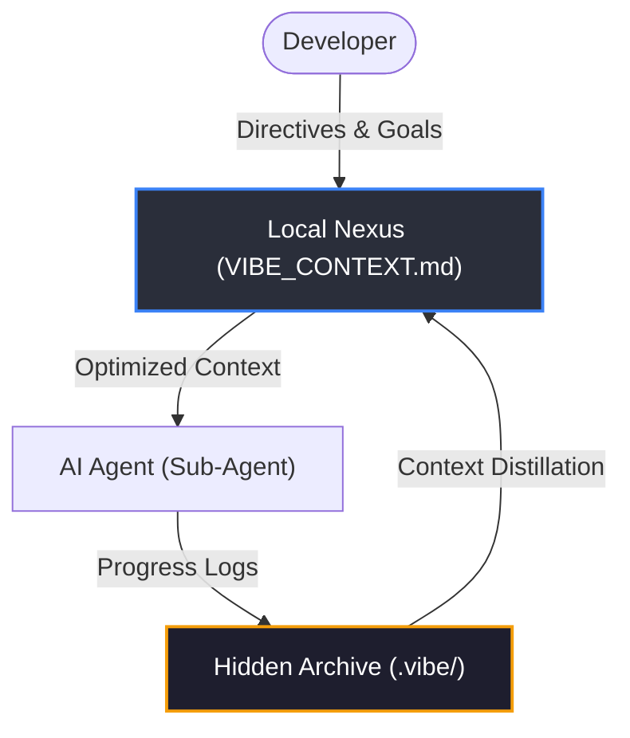
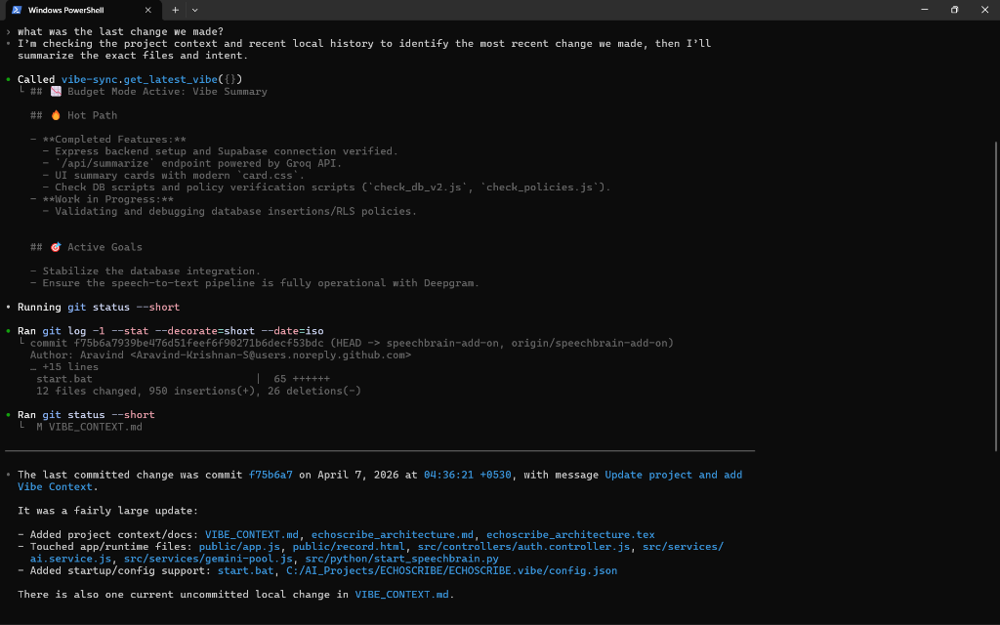
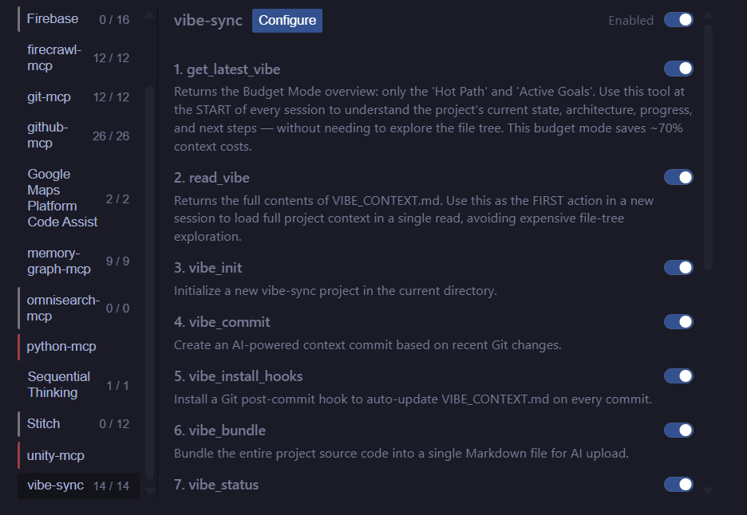
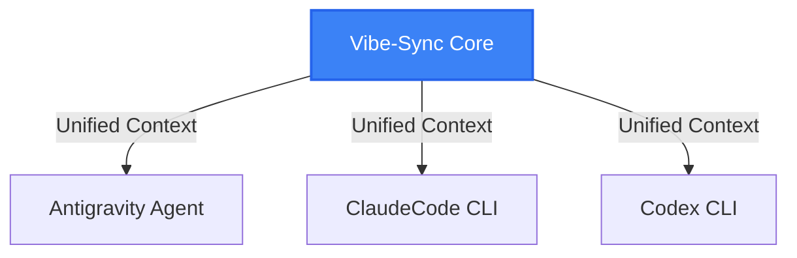
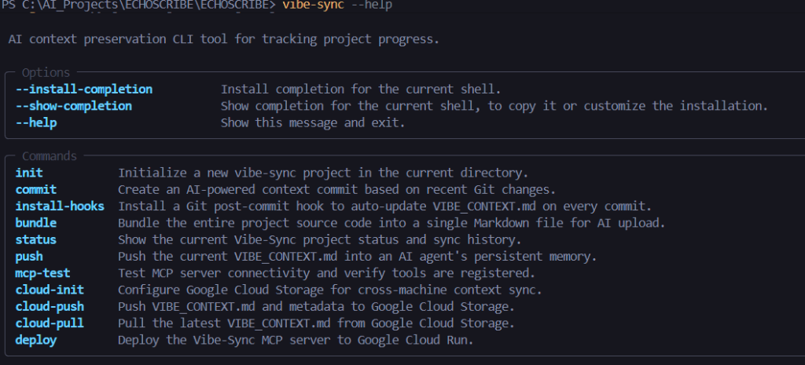

# 🌊 Vibe-Sync
### *The Reliable Context Engine for Agentic AI Workflows*

**Vibe-Sync** is a high-performance framework designed to solve the "context-drift" problem in modern AI-assisted development. By maintaining a persistent and synchronized **Source of Truth**, Vibe-Sync ensures that AI agents can "boot up" into any project with complete architectural clarity, minimizing token waste and maximizing productivity.

## 🏗️ Architecture: The Context Bridge

Vibe-Sync creates a seamless link between your development environment and your AI collaborators, ensuring that every strategic decision and milestone is captured and preserved.

### **🛠️ Custom MCP Server (Personally Developed)**
This project features a **bespoke Model Context Protocol (MCP) server integration**, designed and developed from the ground up to provide high-fidelity, low-latency context retrieval. It empowers agents with specialized tools like "Budget Mode" for extremely efficient project awareness with minimal token overhead.

---

## ☁️ Google Cloud Intelligence Stack

Vibe-Sync is built upon the robust foundation of **Google Cloud**, leveraging its enterprise-grade AI and infrastructure for total reliability.

### **1. Core Reasoning Engines (Gemini & Vertex AI)**
Vibe-Sync uses **Gemini (AI Studio)** as its primary reasoning engine for rapid context synthesis. For high-stakes architectural analysis, it leverages **Vertex AI**, providing an enterprise-grade inference layer with superior resilience.

### **2. Global Context Telepathy (Google Cloud Storage)**
By using **Google Cloud Storage (GCS)**, Vibe-Sync achieves cross-device "telepathy." Developers can synchronize their project context across different machines and sessions, ensuring that the project's "vibe" is never lost.

### **3. Serverless Context Hub (Google Cloud Run)**
The Vibe-Sync MCP server is deployed to **Google Cloud Run**, providing a high-availability, serverless endpoint for AI agents to query project state from anywhere in the world.

---

## 🧬 Agentic Interoperability: Working Example

Vibe-Sync acts as the **Contextual Memory Layer** for next-generation agents. Whether you are using **Antigravity**, **ClaudeCode**, or **Codex CLI**, Vibe-Sync ensures they all share the same "mental model" of your project.

### **The "Cold Start" Solution**
When a new agent session begins, Vibe-Sync provides instant workspace awareness:
1.  **Antigravity** reads the local **Nexus** (`VIBE_CONTEXT.md`).
2.  It instantly understands the **Active Goals**, **Hot Path**, and **Project Architecture**.
3.  Execution begins immediately with 100% architectural alignment.

---

## 🔒 Local-First Privacy (The Nexus)
Your project's "vibe" is stored in `VIBE_CONTEXT.md`. This file serves as the local source of truth and is **never pushed to global repositories**. It remains on your local machine, serving as a secure, private bridge for your AI collaborators.

---

## 🛠️ Global Command Portfolio

Vibe-Sync provides an executive-grade command suite for total project governance.

### **Standard Protocols**
| Command | Focus | Impact |
| :--- | :--- | :--- |
| `vibe-sync init` | **Setup** | Initializes the local context core and metadata audit. |
| `vibe-sync commit` | **Sync** | Portals recent changes into the Nexus via the Inference Cascade. |
| `vibe-sync status` | **Audit** | Summarizes current project health and context telemetry. |
| `vibe-sync bundle` | **Synthesis** | Generates a high-density, AI-ready snapshot of the codebase. |

### **☁️ Google Cloud Ecosystem Commands**
| Command | Operational Domain | Google Product Integration |
| :--- | :--- | :--- |
| `vibe-sync cloud-init` | **Infrastructure** | Configures **Google Cloud Storage** for cross-machine sync. |
| `vibe-sync cloud-push` | **Persistence** | Securely portals local context to your GCS Bucket. |
| `vibe-sync cloud-pull` | **Retrieval** | Synchronizes the latest context from GCS to your local machine. |
| `vibe-sync deploy` | **Deployment** | Deploys the Vibe-Sync MCP server to **Google Cloud Run**. |

---

### **🏆 Team Apex**
- **Aravind Krishnan S** 
- **Pranav P** 

---
© 2026 Team Apex. High-Performance Context Orchestration.
